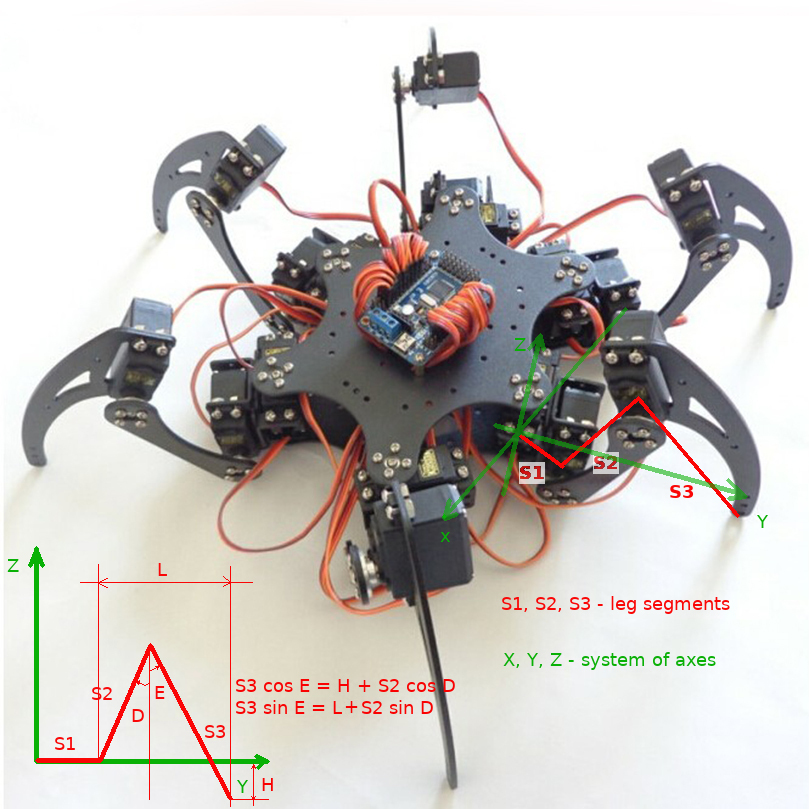

Hexapod
=======

This directory contains software to drive hexapod model.

== Leg mechanics ==

Each leg has three segments (S1, S2, S3 in the code). A motor
turns each segment at an angle (S1, S2, S3 in Segment_Angles or
A, B, C in equations). This could be modeled like this:

